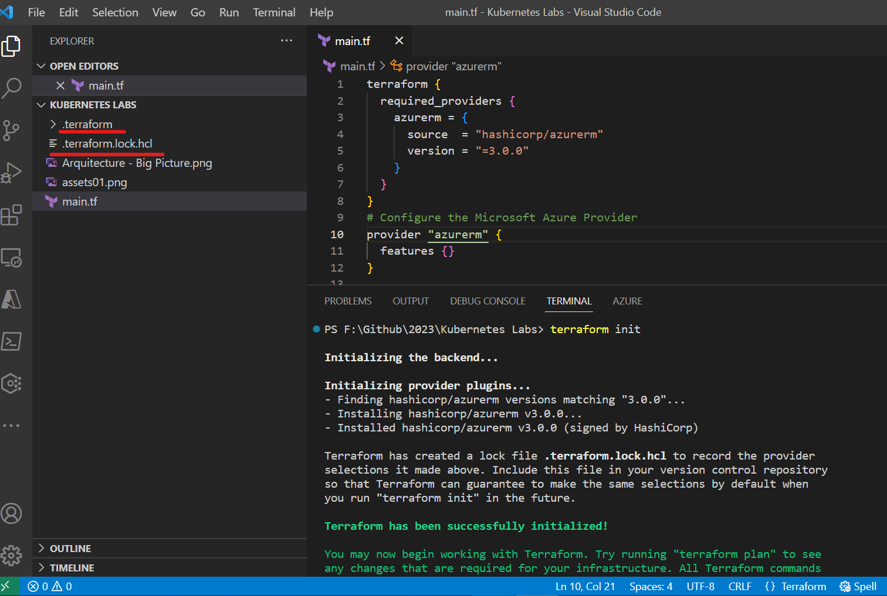
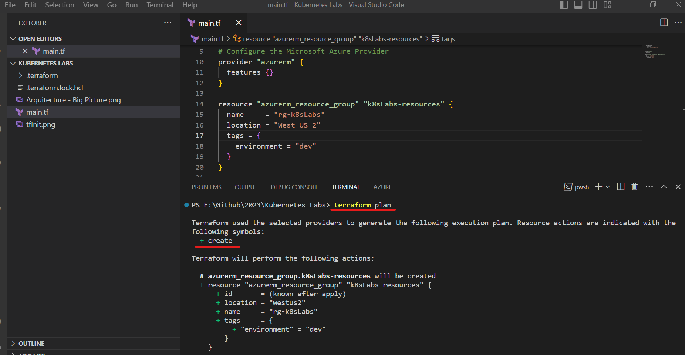
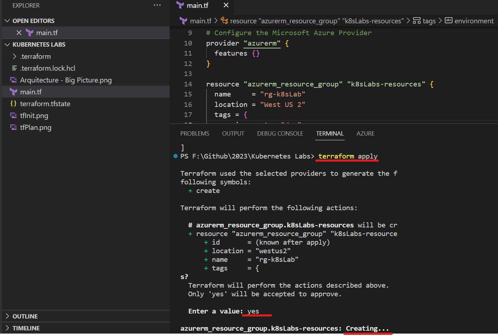
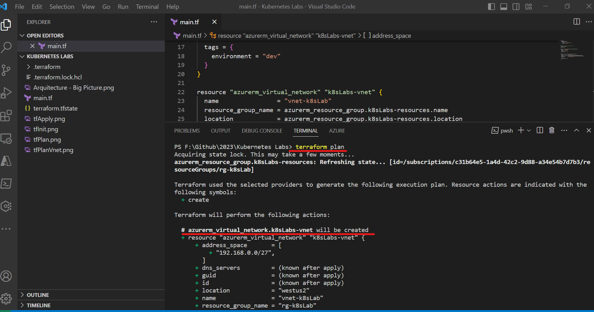
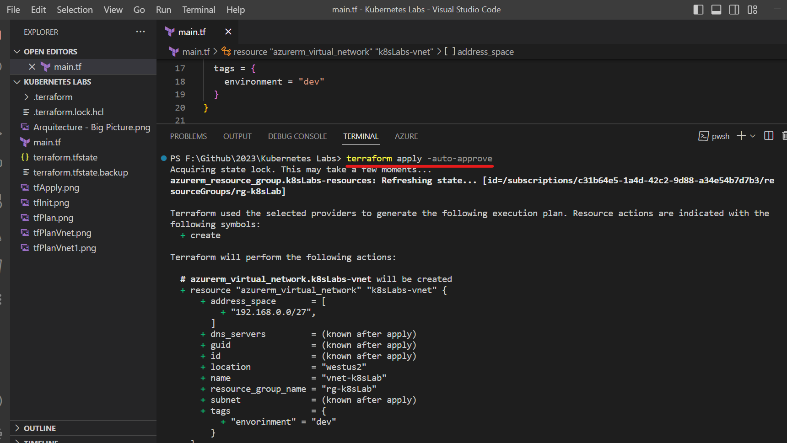

# Terraform Config & Test
Open a new folder where we'll store our files, and I'm going to create a new folder. And we'll just call that Terraform Azure, just like
so. Go ahead and open that, select folder, and all set. And once again, I'll just make sure that Terraform Provider Init.

First thing I'm going to do is just create a new file. And we're going to call that ``main.tf``, just like so. Go ahead and open that. And now I'm just going to pull that out of the way.

Now, at [Terraform Registry](https://registry.terraform.io/providers/hashicorp/azurerm/latest) we've got our Azure provider. And what this provider does is allows Terraform to communicate with the Azure API. That's how Terraform knows
how to deploy resources.

So as you can see, if you look down at [Azure Provider](https://registry.terraform.io/providers/hashicorp/azurerm/latest/docs), you'll see authenticating to Azure.

So this is our configuration that we're going to use for the provider.
```
terraform {
  required_providers {
    azurerm = {
      source  = "hashicorp/azurerm"
      version = "=3.0.0"
    }
  }
}
# Configure the Microsoft Azure Provider
provider "azurerm" {
  features {}
}

```


Now, as you can see, we've got Terraform, and then we've got required providers. So any of the providers we're going to use are specified in this block. So we've got the Azure RM provider.
The source here is HashiCorp Azure RM. And then we've got a version. Now, this is actually freezing this version to 3.0.0. Your version may be different, and that's perfectly fine. Of course,
if something does break, you can always revert to this version. Now, below that, we then actually specify the provider.  
Up here is indicating which providers we'll be using within Terraform. And then here is actually how we will do the
connection and specify any other options that we may want to specify.

Go to the [Argument Reference](https://registry.terraform.io/providers/hashicorp/azurerm/latest/docs#argument-reference) to notice wich are required.

Now, you can just copy and paste that in ``main.tf``

At our terminal, first we'll run a command: ``Terraform FMT``. And that stands for Terraform Format, And as you can see, that kind of cleaned up our code a little bit, removed some indentations, things like that. So it's a good habit to run Terraform Format anytime you are working with any type of files, especially before you commit to your repositories.

let's go to the next step and that is a command: ``Terraform init``, just like so. As you can see, we're initializing the backend and the backend is a local backend, which means that our Terraform state where everything is stored will be stored here.




We've got the.terraform directory here.
This is actually where the provider is stored. And this is a compiled file. So this is actually a compiled go file or in Windows case, an exe file, as you can see. And that is what is used to communicate with the API of Azure. And then what we have is our Terraform lock.hcl. And as you can see, this can constrain the version that we use. You typically want to commit this to your repository. So even if this version isn't set, this lock.hcl will maintain that version to ensure that your code always runs. Now, if you decide to upgrade that provider, you may want to just delete this file or modify the version. So just keep that in mind.

So now let's take a look at the resource group documentation: [azurerm_resource_group](https://registry.terraform.io/providers/hashicorp/azurerm/latest/docs/resources/resource_group). Now, as you can see, we've got some notes here. None of these are going to affect us, but do be aware that whenever you see notes in the documentation like this, it's probably a great idea to read them, as sometimes they will indicate some very, very big issues that you might encounter and how to solve them.
```
resource "azurerm_resource_group" "example" {
  name     = "example"
  location = "West Europe"
}
```
As you can see, we've got a resource here. So just like we have provider here, this is a resource. And this resource is ``azurerm_resource_group``. Now, this cannot change. This indicates the type of resource that you are deploying.
So you want to make sure you use the right name for that resource as Terraform will have no idea what you're trying to deploy if you don't use the right name.

Now, this is an alias --> ``"example"``. The following here can be anything you want. For the most part, you have to adhere to some grammar rules, but for the most part, it can be just about anything you want. And this is how you will reference this resource within Terraform.

```
resource "azurerm_resource_group" "k8sLabs-resources" {
  name     = "rg-k8sLabs"
  location = "West US 2"
  tags = {
    environment = "dev"
  }
}
```

So we've got a resource, Azure RM resource group. And let's just call that ``k8sLabs-resources``, just like so. Now the name, since this is actually in Azure, we're going to make that a little more specific in this case. We'll just call it ``rg-k8sLabs``. And this is also to illustrate that these can be different.

Now let's run a ``Terraform FMT`` once again, and then let's run a ``Terraform plan``, just like so.



And what this is doing is showing us what is going to be built if we run a Terraform apply. So as you can see, we've got our plus signs for create. There are other signs, but right now, we're not changing anything. So you can see that we're creating this new resource. And then under that, you've got the arguments that we're passing in. And as you can see, we've got the ID known after apply, which means we will know that as soon as this is deployed to Azure.

## Test to deploy

So let's go ahead and deploy that: run ``Terraform apply`` and hit enter


Now in the future, we will use the auto approve flag just to skip that because we are running a plan between all of this. So we don't need to get another confirmation. But generally
speaking, when running from the CLI in production, it's probably a good idea to have this extra step just to ensure you don't make any mistakes.

## Deploy the Virtual Network
We're going to set the groundwork for our deployment by deploying a virtual network. In order to do that, we'll also need to learn how to reference attributes of other resources.

So we've got the documentation at [azurerm_virtual_network](https://registry.terraform.io/providers/hashicorp/azurerm/latest/docs/resources/virtual_network), which is where we always start.
Now there are some notes here and eventually these may be deprecated, but for right now they are fairly important. Some of the demos and examples are going to show inline subnets. We're actually not going to do that. We're going to specify our subnet as a separate resource. That gives us more control over the resource itself, how it relates to things, its dependencies, and lots of other little benefits that you'll see as you start to build your own larger deployments.

```
resource "azurerm_virtual_network" "k8sLabs-vnet"{
    name = "vnet-k8sLab"
    resource_group_name = azurerm_resource_group.k8sLabs-resources.name
    location = azurerm_resource_group.k8sLabs-resources.location
}
```

Now one thing you can take a look at here, the resource group name references the resource group. As you can see, azurerm_resource_group.k8sLabs-resources.name. So it is
resource azurerm_resource_group.k8sLabs-resources.name. So we've got the resource type, the resource alias that we provided to it, and then one of the attributes, all using a dot syntax. And then the same thing is specified with location.

Now you could also just specify ``k8sLabs-resources`` if you wanted to, but you don't want to define the same thing in multiple places, because if we were to change ``k8sLabs-resources``,
we'd have to change it in every resource that references it. Now, another reason why it's important to reference resources by their resource address instead of by hard coding them is because this creates an implicit dependency. Basically, now this network will not deploy before this resource group has been created, and the same whenever we destroy. It will not destroy this resource group until this virtual network is destroyed. So by referencing this resource group from the virtual network, we tell Terraform that this virtual network is dependent on this resource group.

And then what we want to do is specify the address space, also known as a citer block. The address space is, and this is actually a list. You can specify multiple address spaces here,
but we're just going to use one. We're going to use ``192.168.0.0/27``. And if you're not familiar with subnets, I strongly recommend you review them. 

```
resource "azurerm_virtual_network" "k8sLabs-vnet" {
  name                = "vnet-k8sLab"
  resource_group_name = azurerm_resource_group.k8sLabs-resources.name
  location            = azurerm_resource_group.k8sLabs-resources.location
  address_space       = ["192.168.0.0/27"]

  tags = {
    envorinment = "dev"
  }
}
```
I think that's everything. Let's go ahead and run our ``Terraform format``. And after that, let's run our ``Terraform plan``.


Let's go ahead and get this network deployed. So Terraform apply. And as I said, we're just going to use a ``Terraform apply -auto-approve`` here. And if you want to see everything else, you can actually do a ``-help``.

