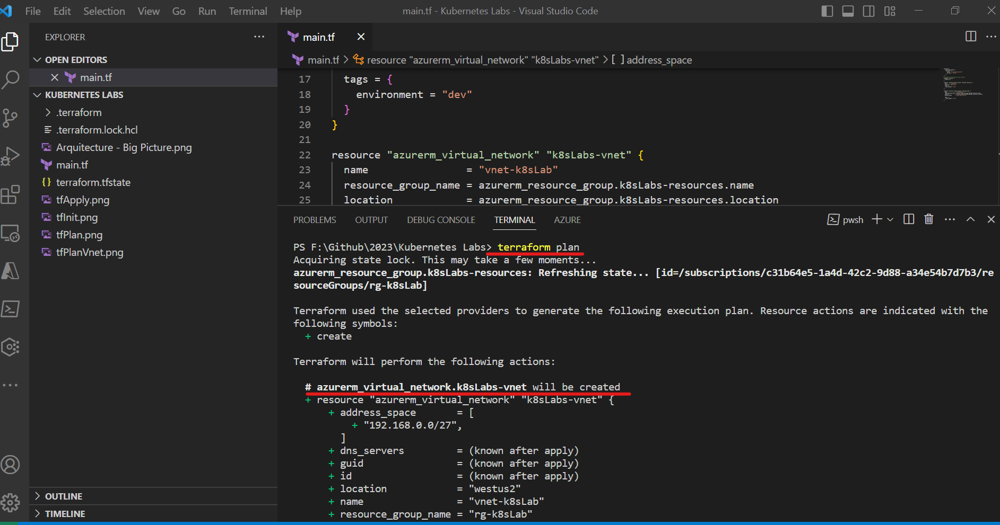
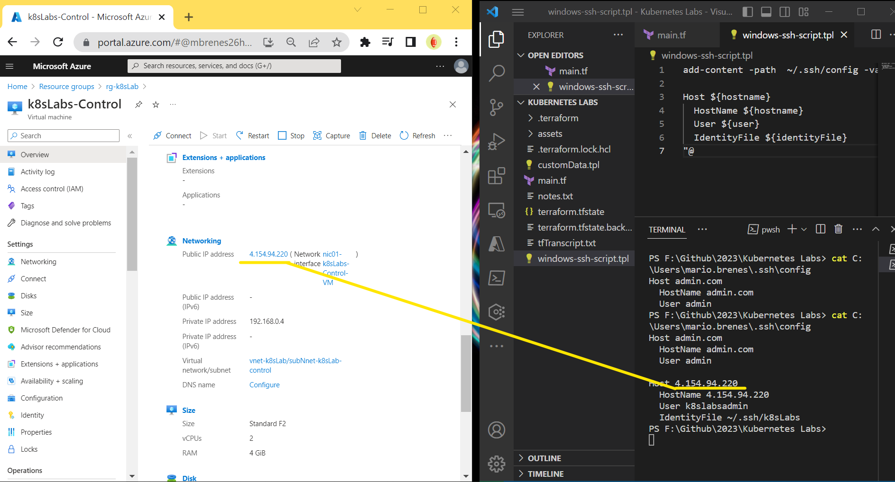

# Terraform Config & Test Deployment
Open a new folder where we'll store our files, and I'm going to create a new folder. And we'll just call that Terraform Azure, just like
so. Go ahead and open that, select folder, and all set. And once again, I'll just make sure that Terraform Provider Init.

First thing I'm going to do is just create a new file. And we're going to call that ``main.tf``, just like so. Go ahead and open that. And now I'm just going to pull that out of the way.

Now, at [Terraform Registry](https://registry.terraform.io/providers/hashicorp/azurerm/latest) we've got our Azure provider. And what this provider does is allows Terraform to communicate with the Azure API. That's how Terraform knows
how to deploy resources.

So as you can see, if you look down at [Azure Provider](https://registry.terraform.io/providers/hashicorp/azurerm/latest/docs), you'll see authenticating to Azure.

So this is our configuration that we're going to use for the provider.
```
terraform {
  required_providers {
    azurerm = {
      source  = "hashicorp/azurerm"
      version = "=3.0.0"
    }
  }
}
# Configure the Microsoft Azure Provider
provider "azurerm" {
  features {}
}

```

Now, as you can see, we've got Terraform, and then we've got required providers. So any of the providers we're going to use are specified in this block. So we've got the Azure RM provider.
The source here is HashiCorp Azure RM. And then we've got a version. Now, this is actually freezing this version to 3.0.0. Your version may be different, and that's perfectly fine. Of course,
if something does break, you can always revert to this version. Now, below that, we then actually specify the provider.  
Up here is indicating which providers we'll be using within Terraform. And then here is actually how we will do the
connection and specify any other options that we may want to specify.

Go to the [Argument Reference](https://registry.terraform.io/providers/hashicorp/azurerm/latest/docs#argument-reference) to notice wich are required.

Now, you can just copy and paste that in ``main.tf``

At our terminal, first we'll run a command: ``Terraform FMT``. And that stands for Terraform Format, And as you can see, that kind of cleaned up our code a little bit, removed some indentations, things like that. So it's a good habit to run Terraform Format anytime you are working with any type of files, especially before you commit to your repositories.

let's go to the next step and that is a command: ``Terraform init``, just like so. As you can see, we're initializing the backend and the backend is a local backend, which means that our Terraform state where everything is stored will be stored here.


We've got the.terraform directory here.
This is actually where the provider is stored. And this is a compiled file. So this is actually a compiled go file or in Windows case, an exe file, as you can see. And that is what is used to communicate with the API of Azure. And then what we have is our Terraform lock.hcl. And as you can see, this can constrain the version that we use. You typically want to commit this to your repository. So even if this version isn't set, this lock.hcl will maintain that version to ensure that your code always runs. Now, if you decide to upgrade that provider, you may want to just delete this file or modify the version. So just keep that in mind.

So now let's take a look at the resource group documentation: [azurerm_resource_group](https://registry.terraform.io/providers/hashicorp/azurerm/latest/docs/resources/resource_group). Now, as you can see, we've got some notes here. None of these are going to affect us, but do be aware that whenever you see notes in the documentation like this, it's probably a great idea to read them, as sometimes they will indicate some very, very big issues that you might encounter and how to solve them.
```
resource "azurerm_resource_group" "example" {
  name     = "example"
  location = "West Europe"
}
```
As you can see, we've got a resource here. So just like we have provider here, this is a resource. And this resource is ``azurerm_resource_group``. Now, this cannot change. This indicates the type of resource that you are deploying.
So you want to make sure you use the right name for that resource as Terraform will have no idea what you're trying to deploy if you don't use the right name.

Now, this is an alias --> ``"example"``. The following here can be anything you want. For the most part, you have to adhere to some grammar rules, but for the most part, it can be just about anything you want. And this is how you will reference this resource within Terraform.

```
resource "azurerm_resource_group" "k8sLabs-resources" {
  name     = "rg-k8sLabs"
  location = "West US 2"
  tags = {
    environment = "dev"
  }
}
```

So we've got a resource, Azure RM resource group. And let's just call that ``k8sLabs-resources``, just like so. Now the name, since this is actually in Azure, we're going to make that a little more specific in this case. We'll just call it ``rg-k8sLabs``. And this is also to illustrate that these can be different.

Now let's run a ``Terraform FMT`` once again, and then let's run a ``Terraform plan``, just like so.


And what this is doing is showing us what is going to be built if we run a Terraform apply. So as you can see, we've got our plus signs for create. There are other signs, but right now, we're not changing anything. So you can see that we're creating this new resource. And then under that, you've got the arguments that we're passing in. And as you can see, we've got the ID known after apply, which means we will know that as soon as this is deployed to Azure.

## Deploy a Resource Group

So let's go ahead and deploy that: run ``Terraform apply`` and hit enter


Now in the future, we will use the auto approve flag just to skip that because we are running a plan between all of this. So we don't need to get another confirmation. But generally
speaking, when running from the CLI in production, it's probably a good idea to have this extra step just to ensure you don't make any mistakes.

## Deploy a Virtual Network
We're going to set the groundwork for our deployment by deploying a virtual network. In order to do that, we'll also need to learn how to reference attributes of other resources.

So we've got the documentation at [azurerm_virtual_network](https://registry.terraform.io/providers/hashicorp/azurerm/latest/docs/resources/virtual_network), which is where we always start.
Now there are some notes here and eventually these may be deprecated, but for right now they are fairly important. Some of the demos and examples are going to show inline subnets. We're actually not going to do that. We're going to specify our subnet as a separate resource. That gives us more control over the resource itself, how it relates to things, its dependencies, and lots of other little benefits that you'll see as you start to build your own larger deployments.

```
resource "azurerm_virtual_network" "k8sLabs-vnet"{
    name = "vnet-k8sLab"
    resource_group_name = azurerm_resource_group.k8sLabs-resources.name
    location = azurerm_resource_group.k8sLabs-resources.location
}
```

Now one thing you can take a look at here, the resource group name references the resource group. As you can see, azurerm_resource_group.k8sLabs-resources.name. So it is
resource azurerm_resource_group.k8sLabs-resources.name. So we've got the resource type, the resource alias that we provided to it, and then one of the attributes, all using a dot syntax. And then the same thing is specified with location.

Now you could also just specify ``k8sLabs-resources`` if you wanted to, but you don't want to define the same thing in multiple places, because if we were to change ``k8sLabs-resources``,
we'd have to change it in every resource that references it. Now, another reason why it's important to reference resources by their resource address instead of by hard coding them is because this creates an implicit dependency. Basically, now this network will not deploy before this resource group has been created, and the same whenever we destroy. It will not destroy this resource group until this virtual network is destroyed. So by referencing this resource group from the virtual network, we tell Terraform that this virtual network is dependent on this resource group.

And then what we want to do is specify the address space, also known as a citer block. The address space is, and this is actually a list. You can specify multiple address spaces here,
but we're just going to use one. We're going to use ``192.168.0.0/27``. And if you're not familiar with subnets, I strongly recommend you review them. 

```
resource "azurerm_virtual_network" "k8sLabs-vnet" {
  name                = "vnet-k8sLab"
  resource_group_name = azurerm_resource_group.k8sLabs-resources.name
  location            = azurerm_resource_group.k8sLabs-resources.location
  address_space       = ["192.168.0.0/27"]

  tags = {
    envorinment = "dev"
  }
}
```
I think that's everything. Let's go ahead and run our ``Terraform format``. And after that, let's run our ``Terraform plan``.



Let's go ahead and get this network deployed. So Terraform apply. And as I said, we're just going to use a ``Terraform apply -auto-approve`` here. And if you want to see everything else, you can actually do a ``-help``.


# Test Terraform State

You may have noticed this ``Terraform.state`` file and this ``Terraform.tfstate.backup`` file. Under very, very, very few circumstances should you ever modify
this state manually. There are specialized commands for making state changes and things.


So for the most part, one, you probably shouldn't have direct access to it. It should be stored remotely. But two, don't go around and start changing things in this state. It's not the
right way to manage your resources.

It specifies the Terraform version. It's got a serial number, a lineage, a lot of really good information to help you understand which state you're dealing with. And every time the state is modified, it actually creates a backup.

So once we run a Terraform apply or destroy again, the Terraform state will be backed up with this Terraform state information and a new ``Terraform.tfstate`` will be created. So as you look through our state here, you can see a lot of very familiar attributes.

Right here, we've got our Azure RM resource group with a name. Then you've got the provider there also. Then under that, we've got ID, location, name, tags, et cetera, et cetera. And as you scroll
down, you'll see we also have our virtual network here. So that's pretty cool. And all of that, of course, is exactly what was deployed within Azure. 

Because again, typically speaking, you're not going to store your state locally. You're going to send it off to some sort of other storage. Some people with AWS store it in S3. You can store it in Terraform's cloud. You can store it in services such as Spacelift and more.

let's go ahead and run a ``Terraform state list``


So that's an easy way to see all of the resources we have. And then if we want more details about what's in those resources, we can run a ``Terraform state show <name_of_recource>``.


So now we get the information from that resource.

And now if we want to see the entire state, we actually just run a ``Terraform show``. So keep that in mind. ``Terraform show`` will show you all of the state, as you can
see here. And then ``Terraform state show <name_of_recource>`` is how you view specific resources, just like so.


So if we take a look at the [Terraform docs here](https://developer.hashicorp.com/terraform/language/state), there's actually a good bit that you can read through. I strongly suggest you get very, very familiar with it.

# Tesing Terraform Destroy & Rebuild


if we take a look at the [Terraform docs: Command: destroy](https://developer.hashicorp.com/terraform/cli/commands/destroy), we can actually see that a few things have changed since Terraform came out. Originally, Terraform destroy was the proper way to do this. And it still works. As you can see Terraform destroy followed by options. This is an alias for Terraform apply dash destroy. Now you can also run a Terraform plan dash destroy, which of course will not perform the destruction. It will just let you know what it's going to do.

Now, of course, what Terraform destroy does here is destroy everything that you've created

But let's take a look at a few things first. First, what I'm going to do is just run a ``Terraform state list``: We have two objects here. As you know, we've deployed both of those


And then if I run a ``Terraform plan -destroy``, as you can see, we've got  **zero to add, zero to change, and two to destroy** . And if you scroll up, you can see that everything has this
little red dash next to it indicating that it's going to be deleted. So if you ever see that red dash, that means that that resource is going to be deleted.


So I'm going to run ``Terraform apply -destroy``, or you can just run Terraform destroy if you'd like. Let's go ahead and run that.


As you can see, it took it a while to delete that resource group. Let's take a look at the ``terraform.tfstate`` and ``terraform.tfstate.backup`` again. Here is the tfstate. As you can see,
there is nothing in here anymore. And the serial has incremented to six. Now if we take a look at the tfstate.backup, here you go. This was our old tfstate. So now if you ever needed to replace the
state or you made a big mistake or something went wrong with the state, somehow the state got corrupted, you have this backup right here. You can delete this tfstate and rename this one

# Deploy a Subnet
And we're going to deploy a subnet into our virtual network. This way we have an IP address space that can be used by our virtual machines.

So as usual, let's take a peek at our [azurerm_subnet](https://registry.terraform.io/providers/hashicorp/azurerm/latest/docs/resources/subnet) resource.

It's got a very similar note here that we saw on our virtual network resource that indicated that these subnets can be deployed in line with the virtual network, but in our case and most other cases, it's better to deploy it separately from the virtual network.

```
resource "azurerm_subnet" "k8sLabs-subNnet-control" {
  name                 = "subNnet-k8sLab-control"
  resource_group_name  = azurerm_resource_group.k8sLabs-resources.name
  virtual_network_name = azurerm_virtual_network.k8sLabs-vnet.name
  address_prefixes     = ["192.168.0.0/28"]
}

resource "azurerm_subnet" "k8sLabs-subNnet-worker" {
  name                 = "subNnet-k8sLab-worker"
  resource_group_name  = azurerm_resource_group.k8sLabs-resources.name
  virtual_network_name = azurerm_virtual_network.k8sLabs-vnet.name
  address_prefixes     = ["192.168.0.16/28"]
}
```

You may run ``Terraform plan`` to see what gonna be happening. As you can see, those were populated just fine by referencing the name of the subnet. So go ahead and run a ``Terraform apply -auto-approve``.


# Deploy a Security Group

First, let's take a look at [azurerm_network_security_group](https://registry.terraform.io/providers/hashicorp/azurerm/latest/docs/resources/network_security_group). And as you can see, we have another note. Now with the security group, you can actually define your **security group rules** in line, just like this, or as separate resources. Now to keep things consistent, we're going to deploy our security group rule as a separate resource, instead of adding it in line. This will make maintaining our security group rules a lot easier and allow us to make deploys and changes without any real unexpected consequences.

```
resource "azurerm_network_security_group" "k8sLabs-nsg" {
  name                = "nsg-k8sLab"
  location            = azurerm_resource_group.k8sLabs-resources.location
  resource_group_name = azurerm_resource_group.k8sLabs-resources.name

  tags = {
    environment = "dev"
  }
}

```
I'm going to select the [azurerm_network_security_rule](https://registry.terraform.io/providers/hashicorp/azurerm/latest/docs/resources/network_security_rule) resource. And if you take a look, Azure RM network security rule example, you've got all of these items here that need to be filled in. And then you reference the resource group name and the network security group name.

```
resource "azurerm_network_security_rule" "k8sLabs-nsgRule" {
  name                        = "k8sLabs-AllTraffic"
  priority                    = 100
  direction                   = "Inbound"
  access                      = "Allow"
  protocol                    = "Tcp"
  source_port_range           = "*"
  destination_port_range      = "*"
  source_address_prefix       = "*"
  destination_address_prefix  = "*"
  resource_group_name         = azurerm_resource_group.k8sLabs-resources.name
  network_security_group_name = azurerm_network_security_group.k8sLabs-nsg.name
}
```
Let's run ``Terraform plan`` to see if we have any typo error. As you can see, those were populated just fine by referencing the name of the subnet. So go ahead and run a ``Terraform apply -auto-approve``.


# Deploy a Security Group Associations

We're going to associate our brand new security group with our subnet so it can be actually used to protect it.

As you can see here, we have our [azurerm_subnet_network_security_group_association](https://registry.terraform.io/providers/hashicorp/azurerm/latest/docs/resources/subnet_network_security_group_association), Luckily, it's not that long of a resource. It's actually very, very straightforward and very simple.

```

resource "azurerm_subnet_network_security_group_association" "nsgRuleAssociation-k8sLabs-AllTraffic-controlSubnet" {
  subnet_id                 = azurerm_subnet.k8sLabs-subNnet-control.id
  network_security_group_id = azurerm_network_security_group.k8sLabs-nsg.id
}
resource "azurerm_subnet_network_security_group_association" "nsgRuleAssociation-k8sLabs-AllTraffic-workerSubnet" {
  subnet_id                 = azurerm_subnet.k8sLabs-subNnet-worker.id
  network_security_group_id = azurerm_network_security_group.k8sLabs-nsg.id
}

```

Let's run ``Terraform plan`` to see if we have any typo error. As you can see, those were populated just fine by referencing the name of the subnet. So go ahead and run a ``Terraform apply -auto-approve``.


# Deploy a Public IP

We're going to give our future virtual machine a way to the internet by creating a public IP. So let's get started. All right, so here we are with the [azurerm_public_ip](https://registry.terraform.io/providers/hashicorp/azurerm/latest/docs/resources/public_ip).

```
resource "azurerm_public_ip" "k8sLabs-PIP-Control" {
  name                = "k8sLabs-PIP-Control"
  resource_group_name = azurerm_resource_group.k8sLabs-resources.name
  location            = azurerm_resource_group.k8sLabs-resources.location
  allocation_method   = "Dynamic"

  tags = {
    environment = "dev"
  }
}
```
Let's run ``Terraform plan`` and run a ``Terraform apply -auto-approve``.


Go ahead and run our ``Terraform state list``, I'm going to do is grab this IP **azurerm_public_ip.k8sLabs-PIP-Control**


When you run ``Terraform state show azurerm_public_ip.k8sLabs-PIP-Control`` will notice there if no Ip address assigned, this is because this resource is not currently attached. But once we deploy our other resources,
we will be able to extract that IP address and use it in the future.

# Deploy a Virtual Network Interface

This NIC will receive its public IP address from the IP address we just created.
So here is our network interface: [azurerm_network_interface](https://registry.terraform.io/providers/hashicorp/azurerm/latest/docs/resources/network_interface)

As you can see, it kind of gets our usual suspects, the name, location, resource group name. We then get the IP configuration under that. And we've got a name for that, subnet ID and private IP address allocation. But as you can see, we don't have public IP address listed here, which is something that is very important to us, so we'll add this argument to our new definition as ``public_ip_address_id = azurerm_public_ip.k8sLabs-PIP-Control.id``

```

resource "azurerm_network_interface" "nic01-k8sLabs-Control" {
  name                = "nic01-k8sLabs-Control-VM"
  location            = azurerm_resource_group.k8sLabs-resources.location
  resource_group_name = azurerm_resource_group.k8sLabs-resources.name

  ip_configuration {
    name                          = "ControlInternal"
    subnet_id                     = azurerm_subnet.k8sLabs-subNnet-control.id
    private_ip_address_allocation = "Dynamic"
    public_ip_address_id          = azurerm_public_ip.k8sLabs-PIP-Control.id
  }
}

```

So if we run a ``Terraform state list``, we've got our nick there. And if we run a ``Terraform state show``, add that to the end. As you can see, we have a private IP address right there, but I'm not seeing a public IP address yet.

# Deploy a Linux Virtual Machine

## Create an SSH Key Pair

This will be used by the Linux VM resource we created so that we can SSH into it later.
As we can see in the [azurerm_linux_virtual_machine](https://registry.terraform.io/providers/hashicorp/azurerm/latest/docs/resources/linux_virtual_machine), we've got the admin SSH key right here.

```
  admin_ssh_key {
    username   = "adminuser"
    public_key = file("~/.ssh/id_rsa.pub")
  }
```

Because we need to create the public_key first, so let's head back into our terminal actually. Let's go ahead and run an ``ssh-keygen -t rsa``. We're going to create an RSA key pair. You'll want to just save it in the same path that's illustrated here. We're just going to rename it.


So if I run an ``ls ~/.ssh``, you can see the key files ready to go.


## Create a Linux Virtual Machine

And then what I want to do is add that key pair. And I'm actually going to put that above this OS disk just to keep it consistent with the documentation, but it really doesn't matter as long as what's within the VM block. So admin SSH key ``username = k8slabsadmin`` as we remembered before and now we're going to use a terraform function. So just like any other programming construct, it basically is the name of the function followed by parentheses. So we're going to use the [file function](https://developer.hashicorp.com/terraform/language/functions/file) and what the file function does is reads a file and substitutes its contents for the value here. Make sure you wrap that in quotes. ``public_key = file("~/.ssh/k8sLabs.pub")``
```
resource "azurerm_linux_virtual_machine" "k8sLabs-VM-Control" {
  name                = "k8sLabs-Control"
  resource_group_name = azurerm_resource_group.k8sLabs-resources.name
  location            = azurerm_resource_group.k8sLabs-resources.location
  size                = "Standard_F2"
  admin_username      = "k8slabsadmin"
  network_interface_ids = [
    azurerm_network_interface.nic01-k8sLabs-Control.id,
  ]

  admin_ssh_key {
    username   = "k8slabsadmin"
    public_key = file("~/.ssh/k8sLabs.pub")
  }

  os_disk {
    caching              = "ReadWrite"
    storage_account_type = "Standard_LRS"
  }

  source_image_reference {
    publisher = "Canonical"
    offer     = "0001-com-ubuntu-server-focal"
    sku       = "20_04-lts"
    version   = "latest"
  }
}

```

So now let's go ahead and apply and make sure that we can log into our instance. So I'm going to run my ``terraform fmt`` once again, to clean all of that up. Then I'm going to run ``terraform plan``. Let's make sure everything is looking good.


and finally run ``terraform apply -auto-approve``


So now let's go and see if we can find that IP address. Let's just run once again, a ``terraform state list``.


And we've got our brand new virtual machine right here. Go ahead and copy that. Then ``terraform state show`` and paste that in.


we can see we've got our public IP address for our instance `` public_ip_address = "4.246.74.48"``

now let's try connect: ``ssh -i ~/.ssh/k8sLabs k8slabsadmin@4.246.74.48``, you may have had a confirmation screen ``yes``


inside the vm connection run ``lsb_release -a`` we can see we are now within our Ubuntu instance.


## Install Docker Engine

We're going to utilize the custom data argument to bootstrap our instance and install the Docker engine. This will allow us to have a Linux VM instance deployed with Docker ready to go
for all of our development needs.

### SSH Config Scripts
First of all, what I want to do is create a new file in VS Code. And we're just going to call that ``customData.TPL``. Now TPL is the extension we typically use for template files. We're not going to make this necessarily a template file, but just for consistency sake, we're going to use that here just in case you'd like to eventually add some variables.

```
#!/bin/bash
sudo apt-get update -y &&
sudo apt-get install -y \
apt-transport-https \
ca-certificates \
curl \
gnupg-agent \
software-properties-common &&
curl -fsSL https://download.docker.com/linux/ubuntu/gpg | sudo apt-key add - &&
sudo add-apt-repository "deb [arch=amd64] https://download.docker.com/linux/ubuntu $(lsb_release -cs) stable" &&
sudo apt-get update -y &&
sudo apt-get install docker-ce docker-ce-cli containerd.io -y &&
sudo usermod -aG docker ubuntu

```

Should be a bash script, just like so. And what this is going to do is install all of the dependencies necessary to install Docker on our machine. So go ahead and save that and feel
free to close that tab.

### Add Custom Data to main.tf

And then what I want to do is add the custom data argument using the [filebase64 Function](https://developer.hashicorp.com/terraform/language/functions/filebase64) The file base 64 function is very much like the file function. But what it does is it encodes it in base 64, which is what the custom data field for Azure is expecting.

```
resource "azurerm_linux_virtual_machine" "k8sLabs-VM-Control" {
  name                = "k8sLabs-Control"
  resource_group_name = azurerm_resource_group.k8sLabs-resources.name
  location            = azurerm_resource_group.k8sLabs-resources.location
  size                = "Standard_F2"
  admin_username      = "k8slabsadmin"
  network_interface_ids = [
    azurerm_network_interface.nic01-k8sLabs-Control.id,
  ]

  custom_data = filebase64("customData.tpl")

  admin_ssh_key {
    username   = "k8slabsadmin"
    public_key = file("~/.ssh/k8sLabs.pub")
  }

  os_disk {
    caching              = "ReadWrite"
    storage_account_type = "Standard_LRS"
  }

  source_image_reference {
    publisher = "Canonical"
    offer     = "0001-com-ubuntu-server-focal"
    sku       = "20_04-lts"
    version   = "latest"
  }
}
```

let's go ahead and run our ``Terraform FMT``. And then let's run a ``Terraform plan``
Now we've got something a little bit different this time around. We've got ``Plan: 1 to add, 0 to change, 1 to destroy.``. So this isn't changed because custom data requires the VM to be redeployed for it to be read. So it's going to destroy our instance and replace it with a new one. As you can see here, custom data forces replacement.


Now, another cool thing you can see is sensitive value. Certain arguments can be dedicated as sensitive and custom data is one of those. This way it does not show up here. Now it can still show up in your state. And that data, of course, is still in this file. But it's not going to show up right here for everyone to see in your terminal. 

Let's go ahead and run a ``Terraform apply -auto-approve``, just like so.


### Test to Login

Let's go ahead and see if we can log in now. So we're going to need to get that IP address again. So let's run our ``Terraform state list``. And we'll just grab that virtual machine right there and ``Terraform state show``, paste that in.
Let's try to connect ``ssh -i ~/.ssh/k8sLabs k8slabsadmin@20.230.232.255``


Let's go ahead and run a ``Docker --version``


Bam!!. Perfect. So now we have Docker installed on our brand new VM, ready to go.

### Install remote SSH extension in VS code

We're going to install the remote SSH extension in VS code, which will allow VS code to open a remote terminal in our VM. And then we're going to take a look at the configuration scripts we're going to use to insert the VM host information into our VM. The VM host information such as the IP address into our SSH config file that VS code uses to connect to those instances.

So first up, on VS Code I'm going to click on extensions here. And I'm going to type remote SSH, just like so. And I'm going to click install.


So open the command palette ``Shift+Ctrl+P`` .And as you can see, mine's already there, but you can also start typing ``remote SSH``. And just to see how things work. If you click on ``add new SSH host``, and let's just say SSH admin at admin.com or whatever.


You can see you've actually got options potentially to configure different files. Go ahead and click on this first one. We want this location to be within our SSH directory. So click on that.


And if you open the config, you can see the format we're looking at. We're looking at a host, host name, user, and identity file, just like so.


So what we're going to want to do is extract that information from our instance and insert it into this configuration file. So let's take a look at how our script is going to do that. Let's go ahead and create a new file. And depending on which operating system you're using, let's go ahead and create the file necessary. So since I'm on Windows, I will use ``windows-ssh-script.tpl``, just like so. And within that file, I'm going to
copy in the script 
```
add-content -path  ~/.ssh/config -value @"

Host ${hostname}
  HostName ${hostname}
  User ${user}
  IdentityFile ${identityFile}
"@

```
So what this is going to do is add the host, host name, user, and identity file to that file that we specify. Now, as you can see, you've got this interpolation syntax here. And what this is doing is essentially dictating that these are variables. And those variables will be passed in using the template file function, which we're going to cover very, very soon. So go ahead and save that.

### The Provisioner

Now, a provisioner is not something you want to use for every deployment. Unlike other resources, a provisioner's success or failure will not be recorded or managed by state. So if something goes wrong, that's just
too bad. There is no rollback or any other way to manage it other than just running it again.
While this is not great for configuring remote instances, it's perfectly fine for something like this. Just adding information to a config file on our local terminal. This is a lightweight operation that doesn't affect the overall success of the deployment if something were to go wrong. So generally speaking, if you need something simple to do, use a provisioner. If you are configuring a remote instance, it's usually best to either use user data, custom data, or another type of application such as Ansible.

So let's take a look over [Provisioners](https://developer.hashicorp.com/terraform/language/resources/provisioners/syntax)

There's actually a lot of great information about using provisioners. And one of the most important things here is the usage of ``self``. 

```
resource "aws_instance" "web" {
  # ...

  provisioner "local-exec" {
    command = "echo The server's IP address is ${self.private_ip}"
  }
}

```

Within a provisioner, you can just specify self and that will extract whatever attribute you need from what you're deploying. So if you need a private IP or a public IP, you just specify self, which simplifies the code. And then of course, you've also got creation time provisioners, which is the default. 

And then you've got destroy time provisioners as well. Destroy time provisioners will perform an action whenever you destroy the script. So just keep that in mind.

```
resource "aws_instance" "web" {
  # ...

  provisioner "local-exec" {
    when    = destroy
    command = "echo 'Destroy-time provisioner'"
  }
}

```

So let's go ahead and set up that provisioner. Now that provisioner is going to be set up within the Azure RM Linux virtual machine block. ``resource "azurerm_linux_virtual_machine" "k8sLabs-VM-Control" {...``

```

#The provisioner
provisioner "local-exec" {
  command = templatefile("windows-ssh-script.tpl",{
...
})
}

  tags = {
    environment = "dev"
  }
}
```

You specify provisioner and then you need to specify the type of provisioner and you have ``local-exec`` and ``remote-exec``. Again, remote exec I would use very sparingly, better to use user data or to use Ansible or some other better tool. But this is a ``local-exec`` provisioner, which means it'll be running locally. And again, lightweight doesn't cause any disaster if something goes wrong with this provisioner. So then what we need to do is provide a command. So let's go ahead and provide that command. That command is actually going to be one of these scripts: . And to specify the script ``windows-ssh-script.tpl`` and pass in the variables, we're going to use what's called a [templatefile function](https://developer.hashicorp.com/terraform/language/functions/templatefile). So if you check out the template file function documentation, you specify template file, just like you did the file function, pass in the path to the file, and then you pass in the variables: `` templatefile(path, vars) ``.

```
provisioner "local-exec" {
    command = templatefile("windows-ssh-script.tpl", {
      hostname     = self.public_ip_address,
      user         = "k8slabsadmin",
      identityfile = "~/.ssh/k8sLabs"
    })
    interpreter = ["Powershell", "-Command"]
    
  }
#for linux will be: interpreter = ["bash", "-c"]
```

Let's go ahead and run a Terraform plan and see if I missed anything else. As you can see, no changes, but we made a pretty big change. That's a lot of typing in our resource here. A provisioner does not get picked up by the state, remember. So it doesn't know that anything has changed. So what we need to do is we need to get rid of this instance. We need to destroy it and reapply it. And there are a lot of ways to do that, but the best way to do it is just to replace it.


So first ``Terraform state list``. Let's go ahead and copy our azurerm_linux_virtual_machine.k8sLabs-VM-Control right there and then run a ``Terraform apply -replace azurerm_linux_virtual_machine.k8sLabs-VM-Control``, and then paste in that resource.

| Step 1 | Step 2 |
|---|---|
| | |


## The Data Sources

Now data sources are ways that we can query items from the provider, in this case, Azure API, and utilize it within our code. Although we don't really need it,
since it's already available in our state file, we're going to query the public IP we're using just to illustrate how data sources work.

We've got the [Data Source](https://developer.hashicorp.com/terraform/language/data-sources) documentation, not too incredibly complicated. Basically, we just specify data instead of resource. We then pass in the data source we want to use, give it a name, and then pass in any of the expected arguments. 

So what we want here is we want the [Data Source: azurerm_public_ip](https://registry.terraform.io/providers/hashicorp/azurerm/latest/docs/data-sources/public_ip) available to us to be released. So we want to be able to see these and access them from within our state and eventually pipe those to an output.

```
data "azurerm_public_ip" "k8sLabs-VM-Control-PIP" {
  name                = azurerm_public_ip.k8sLabs-PIP-Control.name
  resource_group_name = azurerm_resource_group.k8sLabs-resources.name
}
```

So what we're doing is we are querying the IP address we created up here. As you remember, this is the name ``azurerm_public_ip.k8sLabs-PIP-Control`` name. We are querying that to get its IP address. Now, once again, we don't really need to do that because we're using the same state file. We just access it however we want or just access it just using our resource names. But if you, for instance, had another Terraform deployment
without access to that state, then this is a way that we could do it. We could actually use a data source to access that IP within Azure without having to dig through the state file.

So now let's go ahead and see what this looks like and what I'm going to do, we actually don't need to apply again because this data source is not a resource. It doesn't need to be applied. All we need to do is a refresh. So we're still going to use the apply keyword, but we're not going to actually apply anything to Azure at all. So we'll run ``Terraform apply -refresh-only``.

 

And as you can see, there are no changes, but we know we have made a change at least to our configuration file. So we do want to apply, apply complete. Let's now take a look in our state.

You can see we actually have our new data source here. If you scroll down, we've got the IP right there, right at the top, very easy to find. So if I run a ``Terraform state list``, as you can see, we now have our **data:** ``data.azurerm_public_ip.k8sLabs-VM-Control-PIP``

| Step 1 | Step 2 |
|---|---|
| | |

